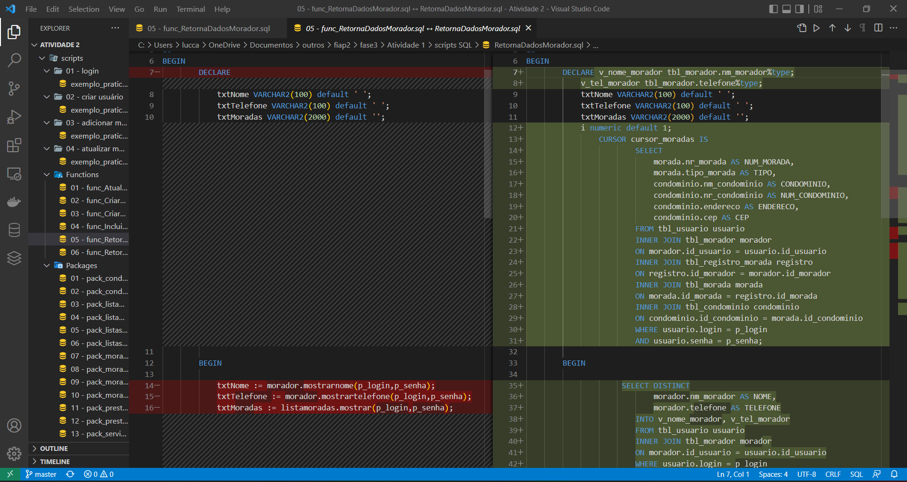
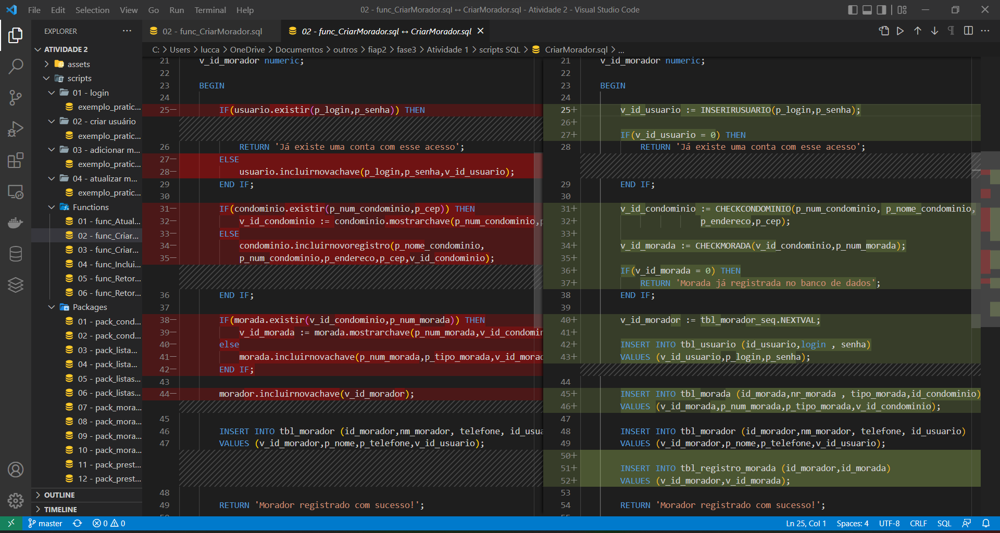

<h1>Fase 3 atividade 2</h1>

<h3>Início</h3>

Na <a href="https://github.com/Amorim-cyber/fiap2_fase3_atividade1">atividade passada</a> listamos as funcionalidades do nosso projeto principal e replicamos cada uma para a linguagem <b>PLSQL</b>. Nós utilizamos tanto `procedures` quanto `functions` na elaboração dos scripts. 

O objetivo dessa atividade 2 foi melhorar estes scripts colocando `packages` e `triggers`. Iremos explicar a mudança nas seguintes funcionalidades:

1. <b>Login</b>

2. <b>Demais funcionalidades</b>

   * <b>Criar Usuário</b>

   * <b>Adicionar Morada</b>

   * <b>Atualizar Morador</b>

<h3>1. Login</h3>

Reduzimos as linhas de código para as funções <a href="scripts/Functions/06 - func_RetornaDadosPrestador.sql" >RetornaDadosPrestador</a> e <a href="scripts/Functions/06 - func_RetornaDadosMorador.sql">RetornaDadosMorador</a> por meio da criação das packages de morador, listaMorada, prestador e listaServico. Encapsulando os blocos de código e nomeando os processos, acreditamos que facilitou mais o entendimento do nosso script.

Segue <a href="assets/video1.mp4">vídeo de demonstração</a>.

 

<h3>2. Demais funcionalidades</h3>

Para as demais funcionalidades, além de ter implementado o uso de packages, adicionamos triggers que são acionadas antes e depois de um insert e update de dados.

Segue <a href="assets/video2.mp4">vídeo de demonstração</a>.

Deixo aqui os scripts exemplos que utilizamos para testar nossas funcionalidades, fique a vontade para utiliza-los como desejar:

* <a href="scripts/01 - login/exemplo_pratico.sql">login</a>
* <a href="scripts/02 - criar usuário/exemplo_pratico.sql">criar novo usuário</a>
* <a href="scripts/03 - adicionar morada/exemplo_pratico.sql">adicionar morada</a>
* <a href="scripts/04 - atualizar morador/exemplo_pratico.sql">atualizar morador</a>

<h3>FORTE ABRAÇO !</h3>